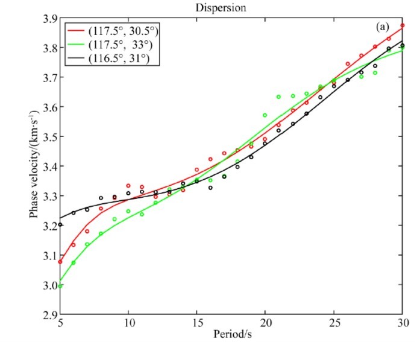

# ZkPhoto
论文等图片的线条、点坐标转换/Transform the points or lines of Paper's Figure to Data
有时候一些论文只有图，而我们需要绘制这些图的数据，例如曲线的坐标，断层的参数等，可以使用该程序，描点获取数据。
# 示例/Example
假设我们需要得到test.png中绿色频散曲线的坐标。
Support that we need to get the dispersion curves of the green line in test.png

