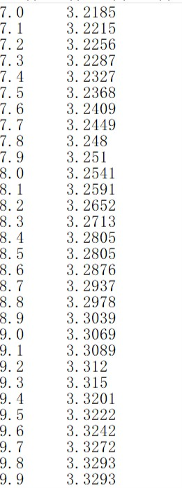
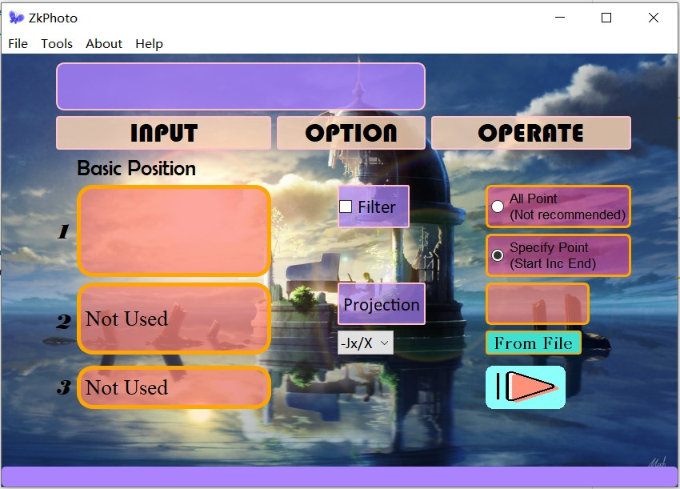

# ZkPhoto
论文等图片的线条、点坐标转换  
Transform the points or lines of Paper's Figure to Data  
有时候一些论文只有图，而我们需要绘制这些图的数据，例如曲线的坐标，断层的参数等，可以使用该程序，描点获取数据。  
## 示例/Example
假设我们需要得到test.png中绿色频散曲线的坐标。  
Support that we need to get the dispersion curves of the green line in test.png  
使用软件，我们得到txt文件如下：  
After using this program, we get a txt:  
  


## 使用/Usage
### Windows
如果你安装有Python3+PyQt5等需要的包体，直接下载后运行ZkPhoto.py即可，**如果没有**，可以下载[exe](https://pan.baidu.com/s/1DS7GO_nhBHRe3BrVrlFzXQ)文件，提取码（1twt）。运行ZkPhoto.exe  
If you have alreadly install python3, PyQt5 and other packages needed, download files and run ZkPhoto.py. Otherwise, you can also download exe files and run **ZkPhoto.exe**  
### Linux
下载运行ZkPhoto.py, 你可能需要安装的包体如下  
Download and run ZkPhoto.py. You may need to install packages such as:  
```bash
pip3 install opencv-python  pyqt5
```
### 操作/Operation
界面如下：  
You will get a interface：  
  
1 点击File，打开图片文件，进入image窗口，鼠标左击选取3个基本框架点（显示为绿色），例如图片左上[5,3.9]，左下[5,2.9]，右下[30,2.9]。  
2 按下CTRL,同时鼠标移动（无需点击）描点（显示为红色点）  
3  ×掉image窗口（**很重要**）  
4 在BasicPosition的1号栏按顺序输入基本框架的**真实坐标**，如 5 3.9 5,2.9 30 2.9  x1,y1,x2... 中间**空格隔开**。在Operate栏输入想要获取的坐标x，格式为 开始x 间隔 结束x 例如 7 1 15（需要在描点范围内，或许后续版本会解除这一限定）  
5 点击开始按钮  

1 Click File, choose your figure. You will enter the 'image' window, and left-click to select three basic frame points (shown in green), such as the top left of the picture, the lower left, and the lower right.   
2 Press CTRL, while moving the mouse (no need to click) to trace the dot (shown as a red dot)  
3 Close the 'image' window (**very important**).   
4 Enter the real coordinates of the basic frame in order in column 1 of BasicPosition, such as 5 3.9 5 2.9 30 2.9  follows x1 y1 x2... Enter the coordinate x you want to obtain in the Operate field in the format of 'startx interval endx' for example 7 1 15 (need to be within the range of the trace point, later versions will remove this restriction).   
5 Click the start button.  
### Tips
1 操作中步骤1和步骤2，顺序任意，可以交叉完成  
2 步骤1，2定下的点均可撤销，操作为，基本框架点右击消去上一个点，绿色将显示为蓝色；绘制点按住alt，移动鼠标撤销，红色将显示为白色。  
3 状态栏会提示一些错误信息。  
4 如果同一图片文件，得到的txt会被**覆盖，记得保存**  
5 一些快捷键可以参考Help菜单  

1 In the operation, step 1 and step 2 can in any order.   
2 Points choosen at step 1,2 can be cancelled anytime. Three basic points can be undone by right-click(green point will be replaced by a blue one) and Red points can be undone by cancelled by moving mouse with 'alt' pressed.   
3 The statusbar prompts some useful error messages.   
4 If the figure files are same, the resulting txt will be **overwritten, remember to save**.   
5 For some shortcut keys, please refer to the Help menu.  

## 待改进/TODO LIST
1 添加滤波效果  
2 添加JM投影，目前只支持JX投影  
3 添加用户自定义所需x坐标点（From File）  
...  

1 Add filter  
2 Add JM projection(Only Jx is supported now)  
3 Users can input a txtfile specified the x point they need  
...  


 
